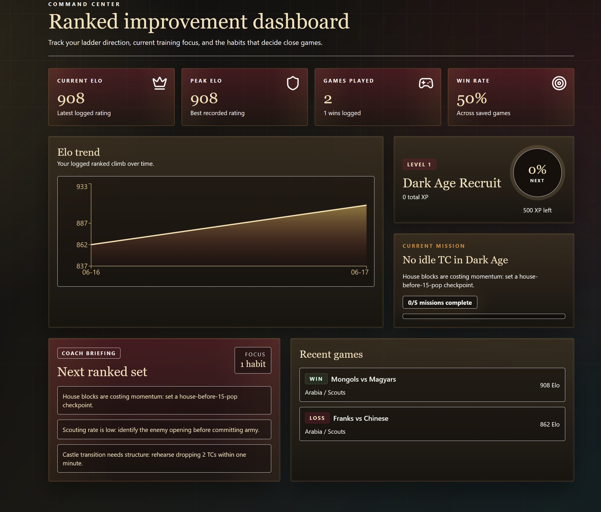

# AoE2 Coach

AoE2 Coach is a local-first web app for tracking and improving ranked Age of Empires II play. It is built for beginners and developing ladder players who want structured practice, clear habits to work on, and a more motivating way to review games than a spreadsheet.

The app runs entirely in the browser. There is no backend, no account system, and no API key requirement.



## What It Does

- Track current Elo, peak Elo, games played, win rate, XP, and level progress.
- Log ranked games with civs, map, opening, Castle Age time, idle TC time, scouting, housing, 2 TC transition, mistakes, and lessons.
- Analyse logged games and surface simple coaching recommendations.
- Complete missions for XP and progression.
- Work through a beginner-focused skill tree from Dark Age to Imperial Age.
- Browse build orders for beginner scout openings.
- Review replays by identifying the minute control was lost and the next-game mission.
- Upload a local CaptureAge `.caderec` recording or readable export to extract timeline signals and coaching notes. Native parsing is experimental and improves with real sample validation.
- Browse civilization crests, beginner civ suggestions, and playstyle tags.

## Privacy

AoE2 Coach stores personal gameplay data in browser LocalStorage:

```text
aoe2coach.games
aoe2coach.missions
aoe2coach.skills
aoe2coach.reviews
```

That data is not written to repo files and is not pushed to GitHub. The repository contains only app code, sample coaching content, and static UI data.

## Tech Stack

- React
- TypeScript
- Vite
- Tailwind CSS
- Recharts
- LocalStorage persistence

## Windows Setup

Install Node.js LTS from [nodejs.org](https://nodejs.org/), then from PowerShell:

```powershell
npm install
npm run dev
```

Open the local URL Vite prints, usually:

```text
http://localhost:5173
```

## macOS Setup

Install Node.js LTS from [nodejs.org](https://nodejs.org/) or with Homebrew:

```bash
brew install node
```

Then from Terminal:

```bash
npm install
npm run dev
```

Open the local URL Vite prints, usually:

```text
http://localhost:5173
```

## Project Status

This is v0.1: a polished local-first foundation for ranked improvement tracking. The focus is currently on habit tracking, beginner missions, local persistence, and a strong game companion feel.

Future ideas include richer replay workflows, match-up notes, more build orders, and import/export.

See [ROADMAP.md](ROADMAP.md) for planned requirements and future product direction.
